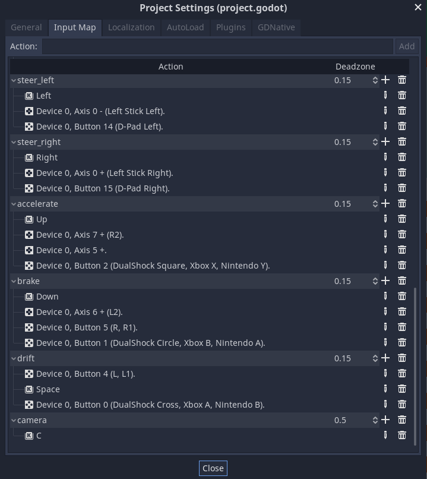

# Godot Racing Game Tutorial

* We are going to make [this racing game](https://electronstudio.github.io/godot_racing/).  Click the link to play it now.

* This game uses Godot's physics engine so that all the objects in the game have real physics.  Notice
what happens when you hit the cones.  (Unfortunately Godot does not have correct car physics built-in,
so the cars control like real life boats or spaceships, but it's still fun for a game.)

* You can play on mobile using the touchscreen buttons.

* You can play with cursors keys and hit 'space' to drift.  (You can also play with a controller.)

* You can hit 'C' key to rotate the camera.

* There is a timer and your best time is (temporarily) saved.

## Getting started

Download [this stater project](godot_racing_starter.zip), unzip and import it into Godot.

Run the game.  Use cursor keys to control.  Press up to get car on screen.

What nodes do we already have?  Let's look at them:

* background - Tilemap of grass tiles
* track - Tilemap of racetrack
* player - RigidBody2D that gives us the car's physics and collisions
  * Sprite - image of the car
  * CollisionShape2D - required for the physics and collisions to work
* objects - some other sprites to decorate the racetrack
* controls - the on-screen control buttons

There is a little bit of code in `player.gd` but notice how the physics engine already
gives us most of the behaviour required for the game.

## Camera

Add a child node of type `Camera2D` to `player`.

In the Inspector, enable `Current`.

Set the `Process mode` to `Physics`.

Try changing the `Zoom x` and `y`.  What happens?

Try enabling `Smoothing`.  What happens?

Try enabling `Rotating`.  What happens?

If you would like the camera to zoom in and out, replace the `camera()` function in `player.gd`
with this code:

```gdscript
func camera():
	var scalefactor = 1.5 + linear_velocity.length()/1000
	$Camera2D.zoom = lerp($Camera2D.zoom, Vector2(scalefactor, scalefactor), 0.01) 
```

## Car Sprite

The `player` node already has a `Sprite` setup so we don't need to add one, but we are going
to modify it.

Click on the `Sprite` node under `player`.  In the Inspector you can see the Texture image.
Choose a new image from `Cars` or `Motorcycles` in the FileSystem and drag it over the Texture
in the inspector.  (Alternatively you could drag it into the scene to create a new `Sprite` node.)

## Car CollisionShape

The car already has a `CollisionShape2D` but you might need to modify it if you
changed the sprite.

## Engine sound

Add an `AudioStreamPlayer` node as a child node of `player`. Rename it `engine`.

In the Inspector find the empty `Stream`.  In the FileSystem find `sounds/engine-loop-1-nomralized.wav`.
Drag this file on to the `Stream`.

Enable `Autoplay` in the inspector.

Replace the function `sound()` in `player.gd` with this code:

```gdscript
func sound():
	$engine.pitch_scale = linear_velocity.length()/1000 + 0.1
```


## Track Tilemap

Click on the `track` node.  Edit the tilemap to create your race track.  You can come back to this and
add more later.

I have only made collision shapes for the red/white barriers.  The other barriers won't work (unless
you edit `racing_tileset.tres` and create your own shapes.)


## Cones

Click on `objects` node.  In the FileSystem find the `cone.tscn` file.  Drag this file into the scene to place a cone.

What happens if you change `Mass` of the cone in the Inspector?

## Other map objects

In the FileSystem folder `Objects` you can find some decorative images.
Click the `objects` node and then drag them into the scene to create sprites. 

## Crash sound effect

Add an `AudioStreamPlayer` node as a child node of `player`. Rename it `crash`.

In the Inspector find the empty `Stream`.  In the FileSystem find `sounds/qubodup-crash.ogg`.
Drag this file on to the `Stream`.

Increase the `Volume` a bit.  Decrease the `Pitch`.  (Click `Playing` to hear it.)

Click on the `player` node.  Click on `Node` on the top right to view the signals.
Double click signal `body_entered(body:Node)` and press `Connect` to connect it to the `player` script.

Replace the function with this one:

```gdscript
func _on_player_body_entered(body):
	$crash.play()
```

## HUD

Create a `CanvasLayer` as a child node of `racetrack` and rename it `HUD`.

Add child nodes to it:
* `Label` named `time`.
  * In Inspector in the `Text` box type: TIME
  * Drag the label to position it.
* `Label` named `best`.
  * In Inspector in the `Text` box type: BEST
  * Drag the label to position it.

For *both* labels, in the Inspector find the `Custom Font` and drag in the
big font from the FileSystem (`interface/fonts/kenvector_futre_32.tres`)

Right click on the root node `racetrack` and select 'Attach Script'.  Press `Create`.
Delete any code in the script, and add this code:

```gdscript
extends Node2D

var time = 0
var best_time = 999

func _process(delta):
	time += delta
	$HUD/time.text = "TIME: " + str(time).pad_zeros(3).left(6)
```

The timer should now work, but it doesn't know when you finish a lap.

## Finishing line - checkpoint

Add an `Area2D` child node to `racetrack`.  Name it `checkpoint`.

In Node Signals, Connect the `body_entered(body: Node`) signal (double click it) to the `racetrack` script (press `connect`)

Replace the generated function with this one:

```gdscript
func _on_checkpoint_body_entered(body):
	if body.name == 'player':
		if(time < best_time):
			best_time = time
		$HUD/best.text = "BEST: " + str(best_time).pad_zeros(3).left(6)
		time = 0
```

Add a `CollisionShape2D` child node to `checkpoint` node.

In the Inspector, set its `Shape` to `New RectangleShape2D`.  Drag the dots to make the rectangle bigger. 
Position the node over the finish line.


## Analogue controls

In Project Settings set up controls like this:



Replace the `input()` function in `player.gd` with this:

```gdscript
func input():
	var steering = Input.get_action_strength("steer_right") - Input.get_action_strength("steer_left")
	if Input.is_action_pressed("drift"):
		apply_torque_impulse(DRIFT_STEERING * steering)
		linear_damp = DRIFT_FRICTION
		$skid.stream_paused = false
		doSkidmark()
	else:
		var acceleration = (Input.get_action_strength("accelerate") - Input.get_action_strength("brake")) * Vector2.UP * ACCELERATION
		apply_central_impulse(acceleration.rotated(rotation))
		apply_torque_impulse(STEERING * steering )
		linear_damp = FRICTION
		$skid.stream_paused = true
```

Notice we already have some exported variables at the top of the program.  Click on the `player` node
and try changing the values of these variables in the Inspector.

## Skid marks

We already have a `skidmark.tscn` scene that contains a skidmark.  We also already have the sound
effect added to the player.

Create a `Node2d` as a child of `racetrack` and name it `skidmarks`.  This will store our skidmark objects.
Try to position it in between the `track` node and the `player` node (since that is where skidmarks should appear.)

Replace the `doSkidmark()` function in  `player.gd` with this:

```gdscript
func doSkidmark():
	var skidmark = Skidmark.instance()
	skidmark.position = position
	skidmark.rotation = rotation
	get_node("/root/racetrack/skidmarks").add_child(skidmark)
```

## Challenges

* 2 players
* Computer controlled cars
* High score table (online)
* Title screen
* Add friends' tracks